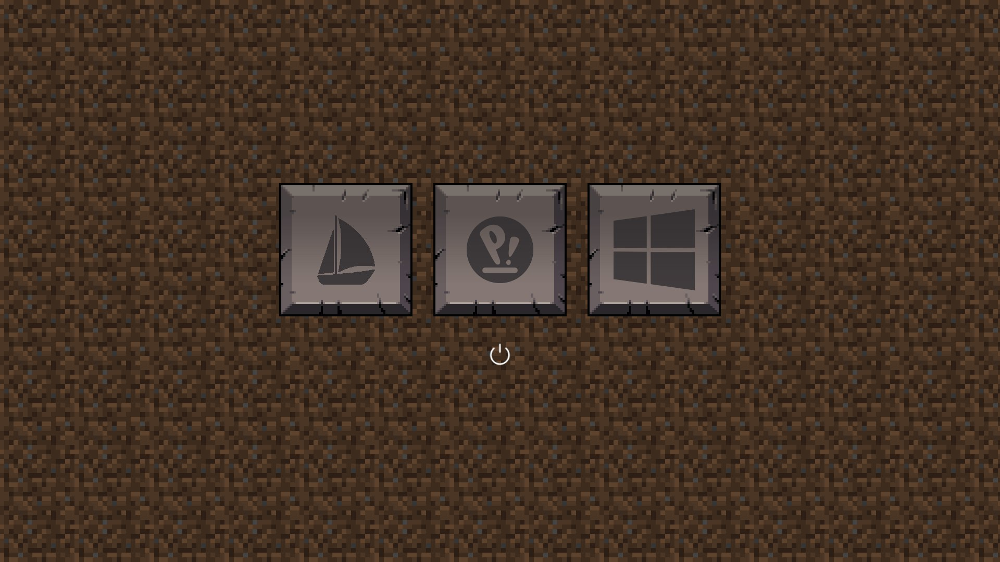

# rEFInd-Minecraft

A Minecraft theme for [rEFInd](https://rodsbooks.com/refind/).

**Do not use the `install.sh` script**

### Problems First
* Bakes the icons to background, so that the button hover 
effect can be imitated. This means if someday a new OS is added,
the boot menu will look strange (Button borders remain constant,
icons present overlap with the buttons).
* How to fix that? Re-build and re-install the theme.
* There are a lot of magic constants around in the script I wrote.
I myself don't understand why that's that way. I am not very 
familiar with the rEFInd code base, so if someone can help, that 
would be great.
* The script is written in kotlin. IDK why, but I should have written 
it in Python instead...
* (((Need testing)))

**Do not use the `install.sh` script**

### So... What did I actually do?
* As far as my meager understanding goes, the selection overlay is 
drawn behind the icons. This makes drawing the button, which is 
a 3 layer task (button up + (button down)? + icon) difficult.
* So... Just merge the (button up) with the background xD

**Do not use the `install.sh` script**

### Usage

Static:
* run `kotlin Build.kt build`
* This will generate a simple theme using [background](templates/bg_1080.png) 
and merge the icons in [icons](icons) with [appropriate selection image](templates/button_big_alpha.png)
* The selection will draw a white border around the icons.
* Skip the next section

Backed:
* If you know the number of icons which will be shown, and they tend
to remain constant for longer periods of time, then you can bake
those icons into the background image.
* run `kotlin Build.kt build bakebg bakebg.osicons=2 bakebg.othericons=1`
* Replace the numbers accordingly.
* This will merge [appropriate button up](templates/button_big_alpha.png)
with the [background](templates/bg_1080.png) and replace selection
with [appropriate button down](templates/button_down_big_alpha.png).
* The selection will be drawn as if, the button was actually pressed.
* Continue the next section

Installation:
* Just copy the rEFInd-Minecraft folder to your rEFInd's themes folder.

**Do not use the `install.sh` script**
