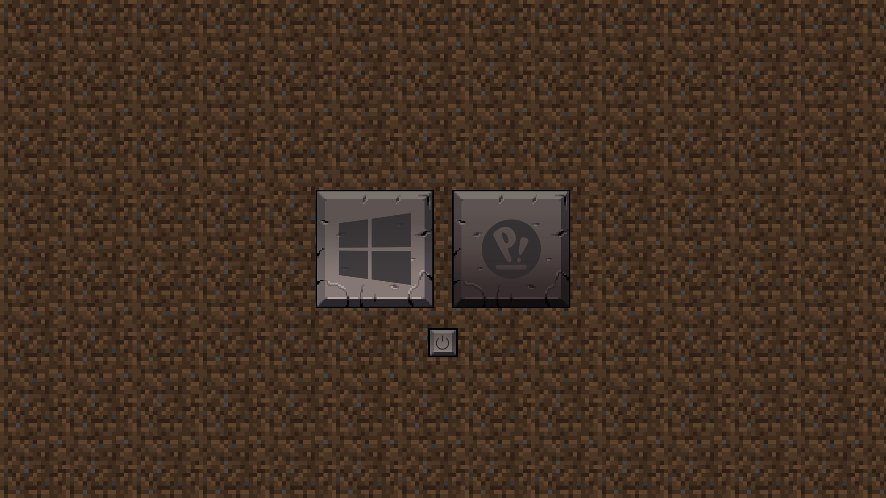

# rEFInd-Minecraft

A Minecraft theme for [rEFInd](https://rodsbooks.com/refind/).

# DO NOT USE IT YET
# DO NOT USE IT YET
# DO NOT USE IT YET
# DO NOT USE IT YET

(The preview image is made in Pixelitor, not what it actually looks like)
((There are some more changes in the way))
(((Need testing)))

### Usage

Clone this repository into a `themes` directory located inside the refind EFI directory
(usually `/boot/EFI/refind`)

Then add `include themes/rEFInd-Minecraft/theme.conf` at the end of the refind.conf.

To hide unwanted options simply press delete while the icon is selected.
To restore hidden icons use the lower right button.
